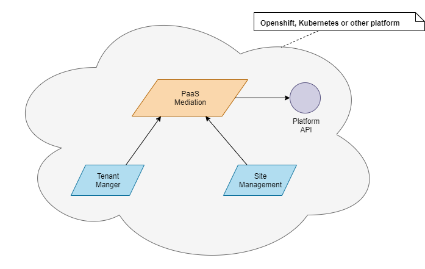

This documentation describes PaaS Mediation Service APIs.

* [PaaS Mediation Overview](#overview) 
* [Deploy Parameters](#deploy-parameters)

# PaaS Mediation Overview

First we need to understand well what a _Platform_ is. 

Platform is an environment where microservices are deployed. For example, it can be OpenShift, Kubernetes or Docker platform. Each of these platforms has different APIs for resource managements. Let us say for creating or deleting a secret entity.

So _PaaS Mediation Service_ is a unified point for other microservices for communicate with platform resources. From the point of view of clients, they work independently of platform as `paas mediation` hides all complexity and the platform differences. 

# Deploy parameters

The following parameters are specific for PaaS Mediation Service.

| Parameter  name                         | Description                                                          |Default| Required |
|-----------------------------------------|----------------------------------------------------------------------|-------|----------|
| PAAS_PLATFORM                           | Indicates platform type, can be `OPENSHIFT` or `KUBERNETES`          |None   | Yes      |
| CORE_PAAS_MEDIATION_GW_API_ENABLED      | Enables [Gateway API](https://gateway-api.sigs.k8s.io/) routes ([HTTPRoute](https://gateway-api.sigs.k8s.io/reference/spec/#httproute), [GRPCRoute](https://gateway-api.sigs.k8s.io/reference/spec/#grpcroute)) observation. Can be `true` or `false`. Ensure PaaS Mediation Service has sufficient permissions to operate (`get`, `list`, `watch`) with `gateway.networking.k8s.io/v1` entities (`HTTPRoute`, `GRPCRoute`)         |false  | No       |

For detailed descriptions of the PaaS Mediation APIs refer to the following sections:

* [REST API](./rest_api.md)
* [Websocket API](./websocket_api.md)
